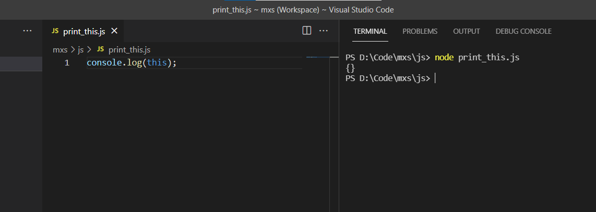
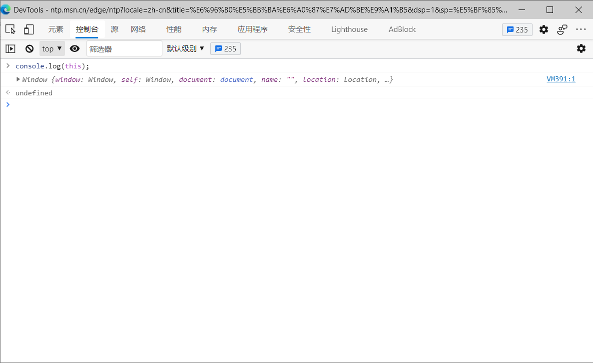

# Node.js


Node.js 保持了JavaScript在浏览器中单线程的特点。

Node.js是构建在 Chrome’s V8 引擎之上的JavaScript 运行时环境。事件驱动(event-driven)和非阻塞 I/O 模型(non-blocking I/O model)的语言特性使 Node.js 天生高效(efficient)且轻量(lightweight)。


Node.js 应用是由哪几部分组成的：
1. 引入 required 模块：我们可以使用 require 指令来载入 Node.js 模块
2. 创建服务器：服务器可以监听客户端的请求，类似于 Apache 、Nginx 等 HTTP 服务器。
3. 接收请求与响应请求 服务器很容易创建，客户端可以使用浏览器或终端发送 HTTP 请求，服务器接收请求后返回响应数据。


Node.js 的出现使 JavaScript 脱离了浏览器，成为一种真正的编程语言。


# Node.js

Node.js 是一个基于 Chrome V8 引擎 的 JavaScript 运行时。  

相关链接：  
[Node.js 官网](https://nodejs.org/zh-cn/)  
[vscode 使用 nodejs](https://code.visualstudio.com/docs/nodejs/working-with-javascript)

# 模块安装

项目目录下执行mpm安装命令安装nodjs模块时，默认安装的位置是在项目的根目录下新建一个node_modules文件夹，然后安装到node_modules目录下。

# 

this 在nodejs环境下默认为空对象，在浏览器环境下默认为Windows对象。  





# 问题总结

```
PS D:\code\renren-fast-vue-master> node -v
v10.14.2
PS D:\code\renren-fast-vue-master> npm run dev

> renren-fast-vue@1.2.2 dev D:\code\renren-fast-vue-master
> webpack-dev-server --inline --progress --config build/webpack.dev.conf.js

[webpack-cli] Error: Unknown option '--inline'
[webpack-cli] Run 'webpack --help' to see available commands and options
npm ERR! code ELIFECYCLE
npm ERR! errno 2
npm ERR! renren-fast-vue@1.2.2 dev: `webpack-dev-server --inline --progress --config build/webpack.dev.conf.js`
npm ERR! Exit status 2
npm ERR!
npm ERR! Failed at the renren-fast-vue@1.2.2 dev script.
npm ERR! This is probably not a problem with npm. There is likely additional logging output above.

npm ERR! A complete log of this run can be found in:
npm ERR!     C:\Users\Administrator\AppData\Roaming\npm-cache\_logs\2021-10-12T11_44_01_024Z-debug.log
PS D:\code\renren-fast-vue-master>
```

解决方法：
```
cnpm install webpack-dev-server@2.9.7
```
