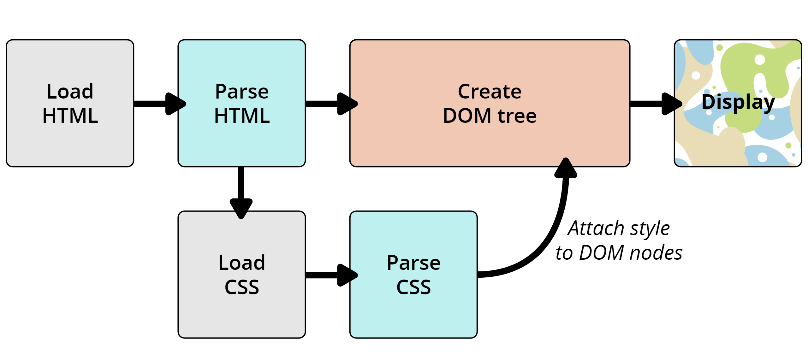

层叠样式表（英语：Cascading Style Sheets，缩写：CSS）是一种用来为结构化文档（如HTML文档或XML应用）添加样式（字体、间距和颜色等）的计算机语言。

CSS不能单独使用，必须与HTML或XML一起协同工作，为HTML或XML起装饰作用。

# 参考文档

[CSS（层叠样式表）](https://developer.mozilla.org/zh-CN/docs/Web/CSS)



# 盒子模型

所有HTML元素可以看作盒子，注意，是所有的。

# 语法

---
书写style属性

border  
background-color  
position  

---
引用CSS有三种方式:  
1. 行内式  
```html
<div style="font-size:30px;width: 100px;height:300px;background-color: red;">hello</div>
```
2. 内嵌式  
```html
<style type="text/css">
    div{
        width: 500;
        height: 700;
        color: green;
        font-size: 50px;
    }
</style>
```
3. 外部式  
在HTML中通过`<link>`标签直接引入的外部样式表  
在CSS中通过@import语句间接引入的外部样式表  

链接式:
```html
<!-- 
  <link type="text/css" rel="styleSheet"  href="CSS文件路径"/> 
  -->

<link type="text/css" rel="stylesheet" href="css/inputcss.css">
```

导入式:
```html
<!-- 
  <style type="text/css">
    @import url("css文件路径");
  </style> 
-->

<style type="text/css">
  @import url("css/inputcss.css");
</style>
```

---

| 标签       | 描述                                                         |
| ---------- | ------------------------------------------------------------ |
| `<style>`    | 定义样式定义。                                               |
| `<link>`     | 定义资源引用。                                               |
| `<div>`      | 定义文档中的节或区域（块级）。                               |
| `<span>`     | 定义文档中的行内的小块或区域。                               |


---

# CSS 选择器

基本选择器
通用选择器（Universal selector）
选择所有元素。（可选）可以将其限制为特定的名称空间或所有名称空间。
语法：* ns|* *|*
例子：* 将匹配文档的所有元素。
元素选择器（Type selector）
按照给定的节点名称，选择所有匹配的元素。
语法：elementname
例子：input 匹配任何 <input> 元素。
类选择器（Class selector）
按照给定的 class 属性的值，选择所有匹配的元素。
语法：.classname
例子：.index 匹配任何 class 属性中含有 "index" 类的元素。
ID 选择器（ID selector）
按照 id 属性选择一个与之匹配的元素。需要注意的是，一个文档中，每个 ID 属性都应当是唯一的。
语法：#idname
例子：#toc 匹配 ID 为 "toc" 的元素。
属性选择器（Attribute selector）
按照给定的属性，选择所有匹配的元素。
语法：[attr] [attr=value] [attr~=value] [attr|=value] [attr^=value] [attr$=value] [attr*=value]
例子：[autoplay] 选择所有具有 autoplay 属性的元素（不论这个属性的值是什么）。
分组选择器（Grouping selectors）
选择器列表（Selector list）
, 是将不同的选择器组合在一起的方法，它选择所有能被列表中的任意一个选择器选中的节点。
语法：A, B
示例：div, span 会同时匹配 <span> 元素和 <div> 元素。
