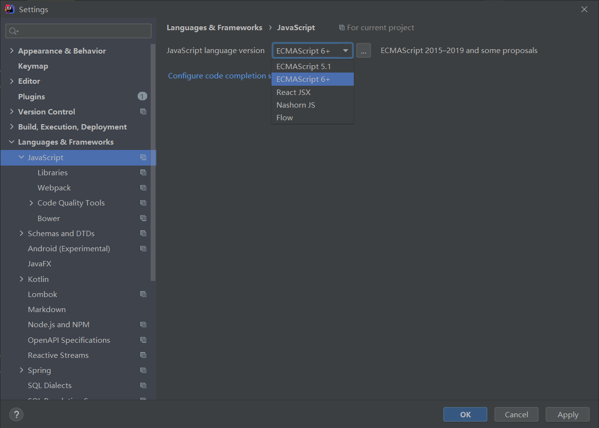
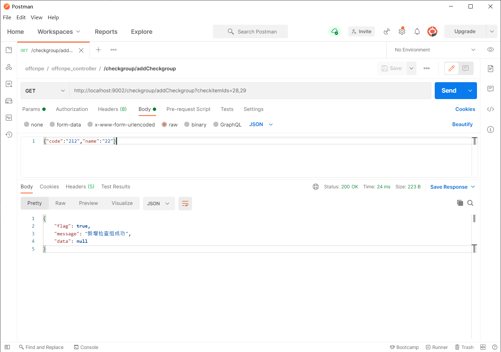

# 简介
官网：[Vue.js](https://v3.cn.vuejs.org/)  
GitHub：（老版本）[vuejs/vue](https://github.com/vuejs/vue)  
GitHub：（新版本）[vuejs/vue-next](https://github.com/vuejs/vue-next)

是中国的大神尤雨溪开发的，为数不多的国人开发的世界顶级开源软件

Vue 是基于 ECMAScript 6 的，在使用 IDEA 开发时需要设置JavaScript语言版本，
否则会有某些语法报错（比如箭头函数）

  

> Vue传递到后台的是 json 格式的数据，后台控制器接收时要加 @RequestBody 注解。

相关链接：  
[官方教程](https://cn.vuejs.org/v2/guide/)  
[开发文档](https://v3.cn.vuejs.org/guide/introduction.html)  

> 官方教程页面包含详细的示例和视频教程


# 主要模块/包
引入方式：  
* 直接下载源码包并用 `<script>` 标签引入。
* 

> 引入后，Vue 会被注册为一个全局变量。


# 

var app = new Vue(...)


el : 指定根element(选择器)
data : 初始化数据(页面可以访问)
methods：
created ：钩子函数
template
watch
filters


组件
Vue.component('todo-item', {
  template: '<li>这是个待办项</li>'
})


箭头函数

# vue生命周期分析
1)初始化显示
    * beforeCreate()
    * created()
    * beforeMount()
    * mounted() //初始化显示之后立即调用
2)更新状态: this.xxx = value
    * beforeUpdate()
    * updated()
3)销毁vue实例: vm.$destory()
    * beforeDestory() //销毁之前调用的函数
    * destoryed() //销毁vue对象的时候调用

# Vue指令
v-text:和js中的innerTest作用类似，可以将vue对象data中定义的数据展示的标签中，不带样式;
v-html:和js中的innerHTML作用类似，可以将vue对象data中定义的数据展示的标签中，带样式
v-model:双向数据绑定
v-bind:数据绑定
v-on:事件监听,用于监听 DOM 事件。 例如 v-on:click 监听点击事件click、mouseover、mouseout、select、focus、blur、

“@”是“v-on”指令的缩写；“:” 是 “v-bind”指令的缩写

获取数据
{{ message }}


条件渲染
v-if、v-else-if、v-else
v-show

列表渲染
v-for  


冒号；艾特

:

:model
:visible.sync
:rules
:span

@

@click


# axios 插件

> axios 插件是基于vue编写，依赖vue，所有要把vue.js引入在axios依赖之前  

[Axios 教程](https://www.axios-http.cn/docs/intro)

## axios 请求
axios 提供一下几种简化的请求方法：  
* axios.request(config)
* axios.get(url[, config])
* axios.delete(url[, config])
* axios.head(url[, config])
* axios.options(url[, config])
* axios.post(url[, data[, config]])
* axios.put(url[, data[, config]])
* axios.patch(url[, data[, config]])

```js
// 向给定ID的用户发起请求
axios.get('/user?ID=12345')
  .then(function (response) {
    // 处理成功情况
    console.log(response);
  })
  .catch(function (error) {
    // 处理错误情况
    console.log(error);
  })
  .then(function () {
    // 总是会执行
  });
```

## axios 响应
axios 使用 then 接收响应，响应包含以下信息：

```js
{
  // `data` 由服务器提供的响应
  data: {},

  // `status` 来自服务器响应的 HTTP 状态码
  status: 200,

  // `statusText` 来自服务器响应的 HTTP 状态信息
  statusText: 'OK',

  // `headers` 是服务器响应头
  // 所有的 header 名称都是小写，而且可以使用方括号语法访问
  // 例如: `response.headers['content-type']`
  headers: {},

  // `config` 是 `axios` 请求的配置信息
  config: {},
```


```
axios.get('/user/12345')
  .then(function (response) {
    console.log(response.data);
    console.log(response.status);
    console.log(response.statusText);
    console.log(response.headers);
    console.log(response.config);
  });
```


axios 向后端传递数据：

集合
数组
单个变量


---
地址栏传参：  
集合可以作为请求体通过json格式传输，数组作为地址栏参数通过url传输。

前端vue代码：
```js
  data: {
      formData: {},
      tableData: [],//新增和编辑窗口中对应的基本信息数据，对应后台的实体类Checkgroup
      checkitemIds: [],//新增和编辑表单中检查项对应的复选框，是个整型数组,基于双向绑定可以进行回显和数据提交
      dialogFormVisible: false,
      dialogFormVisible4Edit: false
  },
  methods: {
    handleAdd() {
      axios.post("/checkgroup/addCheckgroup?checkitemIds=" + this.checkitemIds, this.formData).then((res) => {
          // 后台返回的是Result类型
          console.log(res);
          if (res.flags) {
              this.$message.success = res.data.message;
              this.dialogFormVisible = false;
          } else {
              this.$message.error = res.data.message;
          }
      }).finally(() => {
          this.findPage();
      })
    }
  }
  
```
后端控制层代码：
```java
  @Reference
  CheckgroupService checkgroupService;
  @RequestMapping("/addCheckgroup")
  public Result addCheckgroup(@RequestBody Checkgroup checkgroup,Integer[] checkitemIds){
      return checkgroupService.addCheckgroup(checkgroup,checkitemIds);
  }
```

请求和结果示例：  



# 

在chrome安装vue扩展程序：[Installation](https://devtools.vuejs.org/guide/installation.html)

# 

[2021 年 Angular vs. React vs. Vue 前端框架对比](https://zhuanlan.zhihu.com/p/359540593)  

使用上类似于 AngularJS 

两者都是MVVM框架


angularjs和vue的区别:

1、vueJS简单易学,而angularJS的上手较高；

2、vue专注于View层，主打的是快速便捷，而angularJS功能则比较全面，当然体量也较大，相对没有vue那么便捷；

3、angularJS的指令都是ng-xxx，而vueJS的指令都是v-xxx；

4、angularJS的所有指令和方法都是绑定在$scope上的，而vueJS是new出来一个实例，所有的方法和指令都在这个实例上，一个页面上可以有多个vue实例，但是angularJS的对象只能有一个；

5、angularJS是由google开发和维护的，vueJS是由个人维护的；

6、vueJS一般用于移动端的开发，而angularJS一般应用于大型的项目