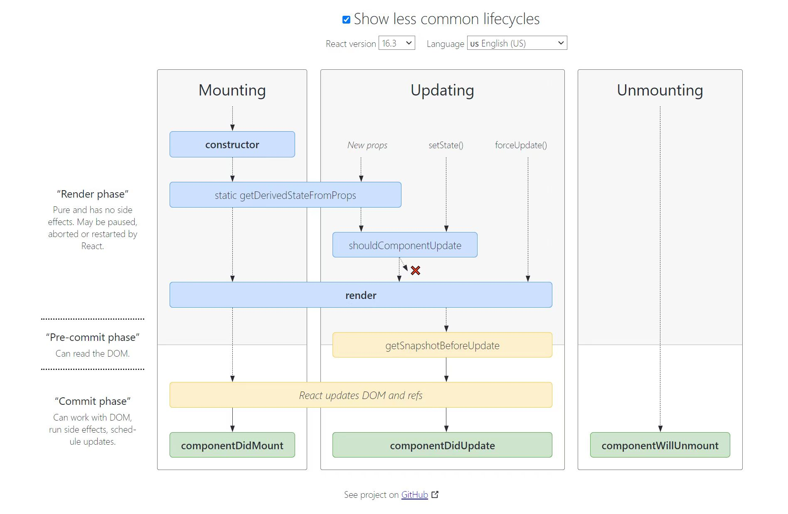
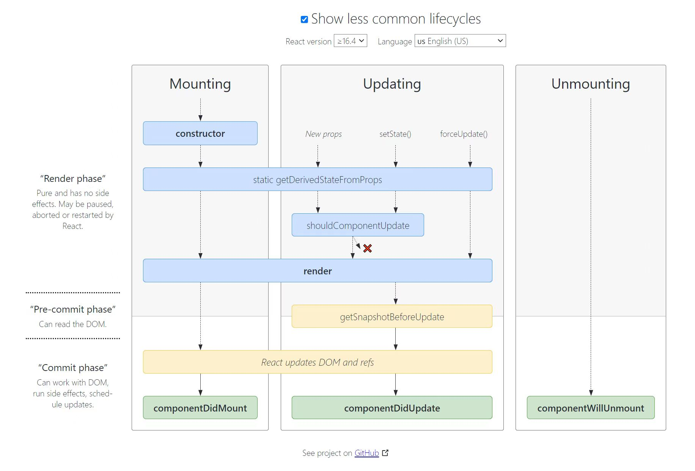

# React

React是Facebook推出的一个前端**JavaScript框架**。


[阮一峰：前端框架 React 及 HTML、CSS in JS](https://www.techug.com/post/react-and-css-in-js.html)


React 出现以后，由于React 是组件结构，强制要求把 HTML、CSS、JavaScript 写在一起。

表面上，React 的写法是 HTML、CSS、JavaScript 混合在一起。但实际上是用 JavaScript 在写 HTML 和 CSS（把HTML和CSS代码写在js文件中）。

React 在 JavaScript 里面实现了对 HTML 和 CSS 的封装，我们通过封装去操作 HTML 和 CSS。也就是说，网页的结构和样式都通过 JavaScript 操作。

# 状态（state） 和 属性（props）

props 是组件对外的接口，state 是组件对内的接口

<!-- 构造函数是唯一可以给 this.state 赋值的地方； -->


# render
所有的前端标签都在 render方法中写

# JSX

```jsx
const element = <h1>Hello, world!</h1>;
```

JSX，是一个 JavaScript 的语法扩展

React 不强制要求使用 JSX

# React组件


在React中，组件通常分为2个大桶： 展示组件和容器组件 。

表示组件与外观有关 ， 容器组件与使事物正常工作有关


React 中的 ref 属性可以帮助我们获取子组件的实例或者 Dom 对象，


React -- 组件的三大属性（state、props、refs）

语法：

字符串形式的ref（已经不再使用）

<input ref="input1"/>

## 展示组件

## 容器组件


DOM container


# React 生命周期
参考链接：[react-lifecycle-methods-diagram](https://projects.wojtekmaj.pl/react-lifecycle-methods-diagram/)

16.3版本：  


16.4版本以后：  


---
从生命周期的图中可以看到，只有当执行`New props`、`set­State()`、`force­Update()`三种操作时才会触发Updating。

---

React16废弃了3个will生命周期：
* componentWillMount
* componentWillReceiveProps
* componentWillUpdate

React16新增的2个生命周期：
* getDerivedStateFromProps
* getSnapshotBeforeUpdate

> React16只是弃用了这3个钩子函数，并没有删除，只是在16中不能和新增的2个钩子函数混用。React17将会彻底删除这3个钩子函数。

## Mounting：

* constructor()  
* ~~componentWillMount()~~  
* render()
* componentDidMount()


> componentWillMount 函数的触发时机是在组件将要装载，在组件render之前调用。与其相对的是另外一个函数 componentDidMount，在组件加载完成， render之后调用，

componentWillMount()是唯一一个在render()之前调用的生命周期方法。因此是在服务端渲染中唯一被调用的方法。

因为componentWillMount()将被删除，所以官方推荐使用constructor()替代该方法

## Updating：

* ~~componentWillReceiveProps()~~ / static getDerivedStateFromProps()
* shouldComponentUpdate()
* ~~componentWillUpdate()~~ / getSnapshotBeforeUpdate()
* render()
* componentDidUpdate()


此过程会在this.state或this.props变更时执行

更新阶段会在三种情况下触发：

更改props：一个组件并不能主动更改它拥有的props属性，它的props属性是由它的父组件传递给它的。强制对props进行重新赋值会导致程序报错。
更改state：state的更改是通过setState接口实现的。同时设计state是需要技巧的，哪些状态可以放在里面，哪些不可以；什么样的组件可以有state，哪些不可以有；这些都需要遵循一定原则的。这个话题有机会可以单独拎出来说
调用forceUpdate方法：这个我们在上一阶段已经提到了，强制组件进行更新。

## Unmounting：

* componentWillUnmount()
