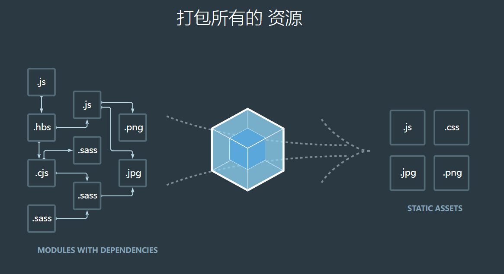

[webpack 概念](https://www.webpackjs.com/concepts/)

本质上，webpack 是一个现代 JavaScript 应用程序的静态模块打包器(module bundler)。当 webpack 处理应用程序时，它会递归地构建一个依赖关系图(dependency graph)，其中包含应用程序需要的每个模块，然后将所有这些模块打包成一个或多个 bundle。

生成的 bundle.js 并没有存放到实际的 物理磁盘中，而是直接 托管到了 电脑的内存中